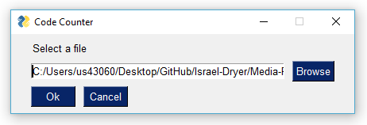
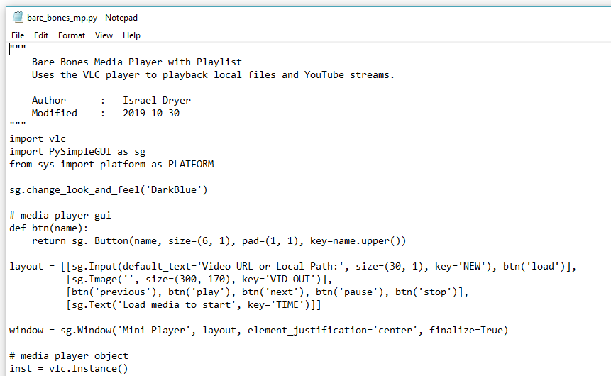

# Code-Counter
A simple program that strips comments and whitespace from a code file and provides summary statistics. This is **very minimal** at the moment, but I'd like to add more in the future (time permitting).

Select a file with the file selector  
  

A file containing **summary statistics** and **stripped code** will open with the default text file editor.  
  
  

An example of the source file that is stripped in the image above.  
  
  

