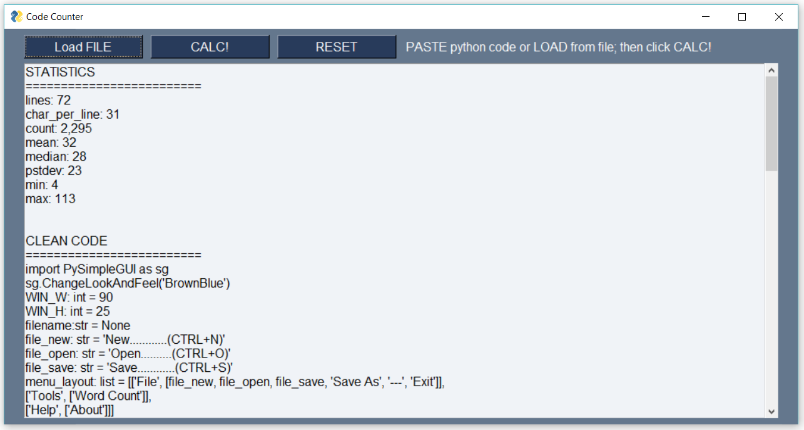

# Code-Counter (in progress)
A simple program that strips comments and whitespace from a code file and provides summary statistics. 
  
When you load Python code from either a **file** or from the **clipboard** your code will be instantly cleaned and measured. Their are tabs for the original **Raw Code** and the new **Clean Code**.    

   

  

